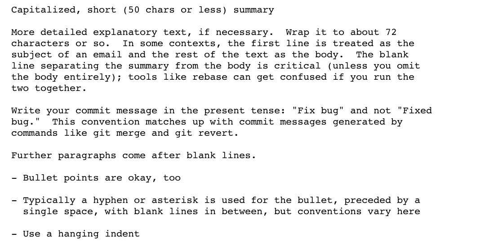

!SLIDE 
# git
## the stupid content tracker

!SLIDE incremental
# We know git right?

!SLIDE incremental
# Things in git

* Things stored in git are objects
* Those objects have an ID
* That ID is a cryptographic hash of the components of that object

!SLIDE incremental
# Things stored in git are objects

* blob - used to store file data
* tree - like a directory, references trees/blobs
* commit - points to a single tree

!SLIDE commandline incremental
# Those objects have an ID 
    $ git rev-parse HEAD
    dca0d08ef9d55d4a024f870eb83adf715ebaeecc

    $ git rev-parse HEAD --short
    dca0d08 

!SLIDE incremental commandline
# That ID is a hash of the components

    $ git ls-tree dca0d08
    100644 blob 24c681c  .gitignore
    100644 blob 3f00574  .rvmrc
    100644 blob 293cb17  Gemfile
    100644 blob 8e4f0f0  Gemfile.lock 

    $ git show 3f00574
    rvm use 1.9.3@gitdemo --create 

!SLIDE
# But we don't always have to use a sha

!SLIDE incremental
## If all these things are true
* we're on our local master branch
* at commit 9ad544f
* we've pushed

!SLIDE incremental
## Then all these are equivalent
    9ad544f0736643f45434e33f20cde1fd9029e971
    9ad544f
    origin/master
    refs/remotes/origin/master
    master
    refs/heads/master
    master@{0}
    HEAD

!SLIDE
!SLIDE bullets incremental
#This is called a Treeish

  * obviously
!SLIDE
#Treeish
## Date

    master@{yesterday}
    HEAD@{1 month ago}

!SLIDE
#Treeish
## Ordinal

    master@{2}
    HEAD@{4}

!SLIDE
#Treeish
## Tilde

    master~2
    HEAD~4

!SLIDE
#Treeish
# Range

    9ad544f..f3e9859c
    9ad544f..HEAD~4 

See also the less common Carrot, Tree Pointer and Blob..

!SLIDE incremental
# so onto gitiquette

* Know what you're committing
* Know what you're not committing
* Commit with a well formed message
* Know what you're pulling
* Resolve conflicts with care

!SLIDE commandline incremental
## Know what you're committing

    $ git status
    $ git diff
    $ git diff --stat

!SLIDE commandline incremental
## Know what you're committing

    $ git add --all app
    $ git add --all lib/file.rb
    $ git add lib/file.rb -p  

!SLIDE commandline incremental
## Know what you're committing

    $ git add -i

!SLIDE commandline incremental
## Know what you're not committing

    $ git stash
    $ git stash save "wip"
    $ git stash list
    $ git stash apply stash@{0}

!SLIDE commandline incremental
## Commit with a well formed message

    $ git commit -am "hack"

!SLIDE
# ┻━┻︵ヽ(`Д´)ﾉ︵┻━┻

!SLIDE commandline incremental
## Commit with a well formed message
    $ git config --global core.editor emacs
    $ git commit

### Follow @tpope's advice
!SLIDE

!SLIDE incremental
# But we all forget things

!SLIDE incremental commandline
# FIFY
## Commit with a well formed message

    $ git commit --amend

!SLIDE commandline incremental
# Rewrite history
## Commit with a well formed message

    $ git commit -m "RT1234..."
    ..realise you forgot something..
    $ git commit -m "fixup! RT1234"
    Then autosquash your last 2 commits
    $ git rebase --autosquash HEAD~2

!SLIDE commandline incremental
# use the force
    $ git push origin +my_branch
    $ git push origin my_branch --force

!SLIDE
# Never change public history
# or people will hate you
!SLIDE commandline incremental
# Know what you're pulling

    $ git log origin/master -p 
    $ git fetch origin
    $ git whatchanged
    $ git log --graph --oneline

!SLIDE incremental
# Rebase Workflow

* never commit directly to master
* update master using git pull origin master
* rebase your feature branch from your local master

!SLIDE
# Rebase
### if I branch when master is at B
          1---2---3 #my_branch
         /
    A---B #master
    
### and our branches diverge
          1---2---3 #my_branch
         /
    A---B--C--D--E--F #master 

!SLIDE
# Rebase
### Rebase replays my changes onto current master
                      1---2---3 #my_branch
                     /
    A---B--C--D--E--F #master
### So it's as if I branched today
### No merge bubble
### No messy history
!SLIDE incremental
# My workflow

* Never work or commit directly to master
* use branches for everything
* rebase feature branches from master
* squash working commits to one single feature commit
* merge this feature into master via a release branch

!SLIDE commandline incremental
# For example

    $ git pull origin master
    $ git checkout -b feature/my_branch
    ..work / commit..
    $ git checkout master
    $ git fetch origin
    $ git pull origin master
    $ git checkout feature/my_branch
    $ git rebase -i master
    ..work / commit..

!SLIDE commandline incremental
# keep it clean

    $ git push origin :release/my_branch
    $ git branch -D release/my_branch

!SLIDE commandline incremental
## only ever push one branch

    $ git push origin
    will push all changes on the local branches that have
    matching remote branches at origin

    $ git push origin my_branch

!SLIDE smaller

## ~/.zshrc
    @@@ c
      function current_branch() {
        ref=$(git symbolic-ref HEAD 2> /dev/null) || return
        echo ${ref#refs/heads/}
      }

    alias ggpush='git push origin $(current_branch)'
    alias ggpull='git pull origin $(current_branch)'

!SLIDE smaller

    $ git clone git@github.com:seenmyfate/git_demo.git

!SLIDE commandline incremental
# one liners

    $ git show-ref --heads
    see if your branches are up to date
    $ git log --pretty=oneline -S'massive_fail'
    search for when someone added the term to the repo
    $ git blame test/functional/posts_controller_test.rb
    the precursor to git punch
    $ git grep -c -n <term/regexp> $(git rev-list --all)
    search historically for a term or rgexp
    $ git log --graph
    historic graph goodness
    $ git log --all -M -C --name-only --format='format:' \
      "$@" | sort | grep -v '^$' | uniq -c | sort | \
      awk 'BEGIN {print "count\tfile"} {print $1 "\t" $2}'
    churn 

!SLIDE commandline incremental
# config

    $ git config --global help.autocorrect 1
    $ git commint                                                                                          
     WARNING: You called a Git command named 'commint',
     which does not exist.
     Continuing under the assumption that you meant 'commit'

!SLIDE smaller

     $ git config --global color.ui true

!SLIDE smaller incremental

     $ git config --global core.whitespace trailing-space
     $ git rebase --whitespace=fix HEAD~1

!SLIDE commandline incremental
# Bisect

    $ git bisect start
    $ git bisect good 85d026e
    $ git bisect bad 6a24cd3
    $ git bisect run rake
    $ git show
    $ git bisect reset

!SLIDE bullets smaller

## Further reading:

* man git
* http://progit.org/book/
* http://book.git-scm.com/index.html
* https://github.com/github/gitignore
* http://marklodato.github.com/visual-git-guide/index-en.html
* http://tbaggery.com/2008/04/19/a-note-about-git-commit-messages.html
 
### tom-clements.com | github.com/seenmyfate
### @Seenmyfate

